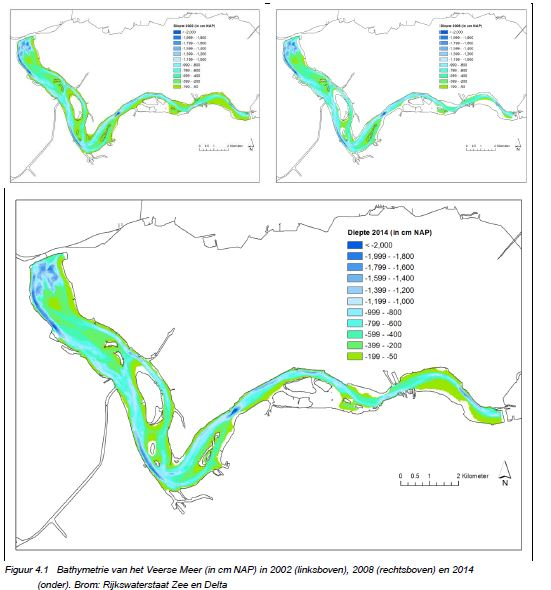
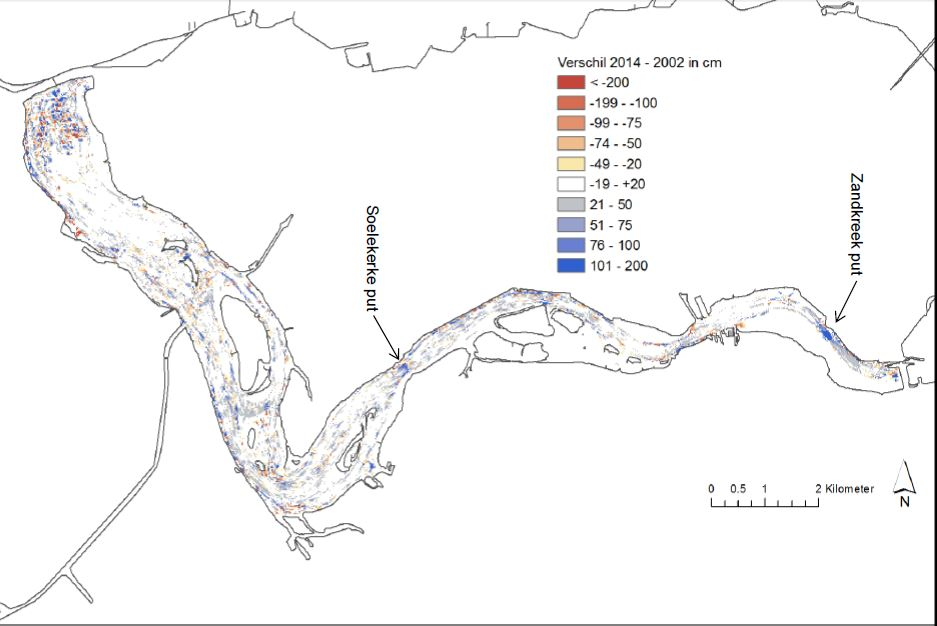
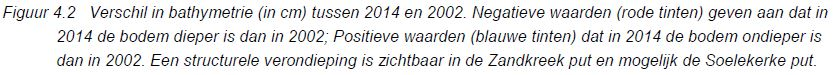
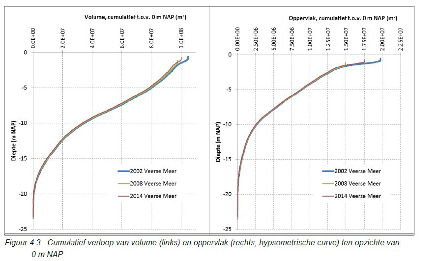
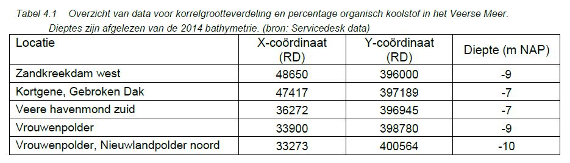
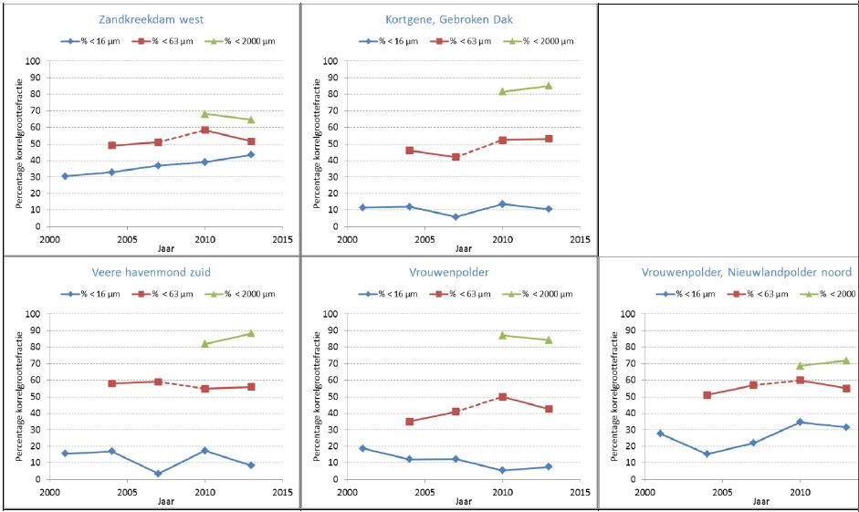
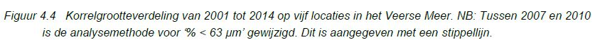
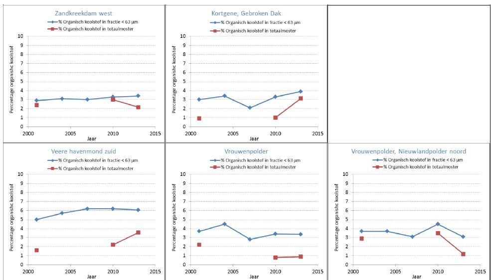
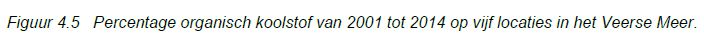
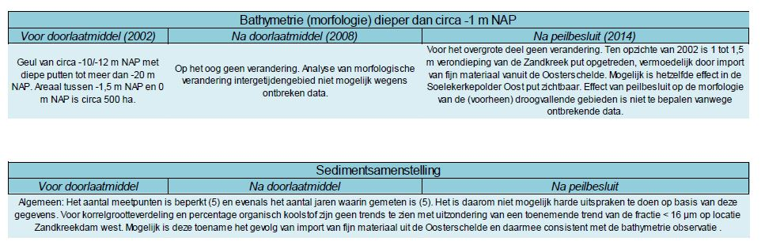

```{r load_packages, include=FALSE}
library(readr)
library(ggplot2)
library(plyr)
library(reshape2)
library(png)
library(pander)
```
# 4. Bathymetrie en sedimentsamenstelling
##4.1. Bathymetrie (morfologie)
###4.1.1. Monitoring
Voor de bathymetrie zijn kaarten van 2002, 2008 en 2014 beschikbaar gesteld door Rijkswaterstaat Zee en Delta. De eveneens beschikbare kaar van 1990 is in deze rapportage niet gebruikt. De gegevens betreffen rasterdata met een 20m x 20m resolutie. De minimale diepte die in de kaarten is opgenomen is -0,57 m NAP,-1,14 m NAP en -0,66 m NAP voor respectievelijk 2002, 2008 en 2014. De in de winter droogvallende delen dan wel de ondiepe gebieden bij zomerpeil (hoger dan circa -1 tot -0,5 m NAP) zijn niet in de bathymetriekaarten opgenomen. Op basis van deze gegevens kan derhalve geen uitspraak gedaan worden over de (morfologische) ontwikkeling van de droogvallende gebieden of de intergetijdengebieden.

Een combinatie met het actueel hoogte bestand Nederland (www.ahn.nl) is mogelijk om deze gebieden toe te voegen aan de bathymetrie. Dat is in het kader van deze rapportage niet gedaan.
###4.1.2. Bathymetrie (morfologie)
Figuur 4.1 toont de bathymetrie van het Veerse Meer in de drie verschillende jaren. De geul van -10 tot -12 m NAP diepte met daarin diepere putten tot meer dan -20 m NAP is duidelijk zichtbaar naast aanzienlijk ondiepe gebieden. Op het oog zijn er geen verschillen tussen de drie jaren zichtbaar.

In Figuur 4.2 is daarom het verschil tussen 2014 en 2002 getoond waarbij negatieve waarden een verdieping en positieve waarden een verondieping in 2014 ten opzichte van 2002 aangeven. Uit de figuur blijkt dat verschillen over het algemeen klein zijn. Het vlekkerige patroon bijvoorbeeld in het westen ter hoogte van de Veersedam wordt zeer waarschijnlijk veroorzaakt door interpolatie- en extrapolatietechnieken van de originele gegevens naar het raster. Vooral bij steile bodemgradiënten kan een afstand van enkele meters een verschil uitmaken in de gemeten diepte van tientallen centimeters. Wanneer verschillende jaren niet op exact hetzelfde punt gemeten hebben, kan door interpolatie naar hetzelfde raster dergelijke verschillen ontstaan.

De enige structurele verandering die geobserveerd wordt, is de verondieping van de Zandkreek put (overeenkomend met TSO-locatie 16, Error! Reference source not found.). Over een relatief groot areaal is de bodem ondieper geworden tot maximaal 1,5 m ondieper in het diepste punt van de put. Mogelijke verklaring is de aanvoer van slib met het Oosterschelde water via de Katse Heule dat in de eerste diepe put na de instroming uitzakt. Op een kleiner gebied is mogelijk ook een verondieping zichtbaar in de Soelekerke put (TSO-locatie 10).






Het cumulatief verloop van volume en oppervlak met de diepte laat eveneens zien dat er weinig verschil is tussen de verschillende jaren. De verschillen die boven circa NAP-1 m ontstaan zijn waarschijnlijk het resultaat van onnauwkeurigheid van de meetmethode in zeer ondiep water (Figuur 4.3).


##4.2. Sedimentsamenstelling
###4.2.1. Monitoring
De korrelgrootteverdeling en het percentage organisch koolstof worden eens in de drie jaar gemeten op vijf locaties (Tabel 4.1). De bemonstering vindt in maart, april of mei plaats.



###4.2.2. Korrelgrootteverdeling en percentage organisch materiaal
De korrelgrootteverdeling is beschikbaar in drie klassen: < 16 μm, < 63 μm en tussen 16 en 2000 μm. Voor Figuur 4.4 is de fractie < 2000 μm berekend door de fracties ‘< 16 μm’ en ‘tussen 16 en 2000 μm’ bij elkaar op te tellen. Figuur 4.4 toont het verloop van de korrelgrootteverdeling van 2001 tot 2014. Omdat het aantal datapunten klein is zowel in ruimte (5 locaties) als in tijd (5 jaren), kunnen geen harde uitspraken over ruimtelijke spreiding en trends in de tijd gedaan worden. Het aantal datapunten is sowieso te gering om een verandering als gevolg van de ingebruikname van de Katse Heule of het peilbesluit te detecteren. Evenmin is bekend in hoeverre deze locaties representatief zijn om algemene uitspraken over (de ontwikkeling van) het Veerse Meer te doen.

Met uitzondering van de fractie <16 μm op de locatie Zandkreekdam die een stijgende trend laat zien, lijkt de korrelgrootteverdeling niet trendmatig te variëren. Een reden voor deze toename op Zandkreekdam west is niet voorhanden. Mogelijk is dit een indicatie van de import van fijn materiaal vanuit de Oosterschelde dat in de eerste diepe putten na de Zandkreekdam uitzakt doordat de stroomsnelheden in het Veerse Meer veel lager zijn dan in de Oosterschelde. Alle locaties samennemend varieert de fractie <16 μm tussen 10% en 40%, de fractie <63 μm tussen 40% en 60% en de fractie <2000 μm tussen 60% en 90%.







Het percentage organisch koolstof laat geen duidelijke trendmatige verandering zien over de
periode 2001-2014 (Figuur 4.5). Het percentage in de fractie <63 μm varieert ruwweg tussen
3% en 4% met uitzondering van locatie Veere havenmond zuid, waar het percentage 5% tot
6% is. Grofweg aannemende dat de fractie <63 μm ongeveer 50% van het totaal is (Error!
Reference source not found.), is het percentage organisch koolstof in het sediment op deze
locaties de helft van de genoemde getallen, respectievelijk 1,5%-2% en 2,5-3%.

