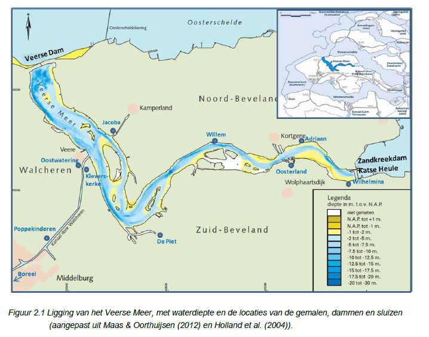
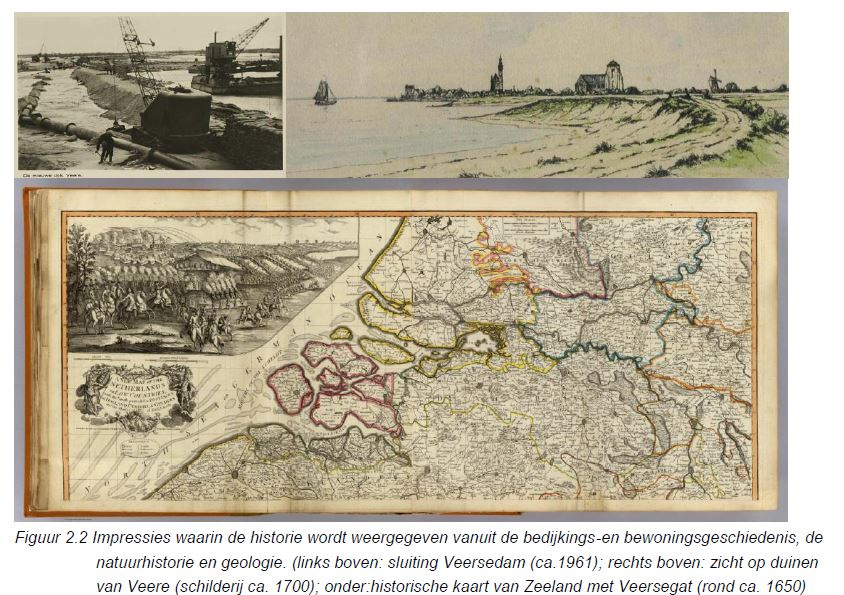
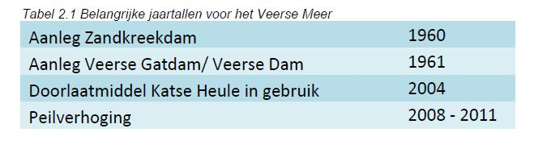
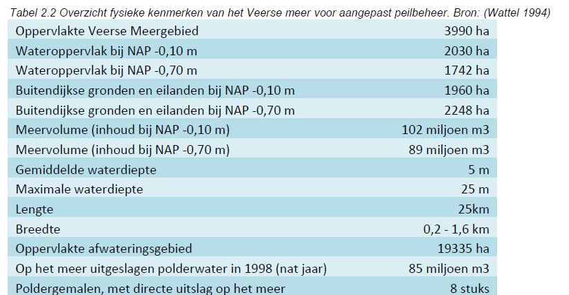
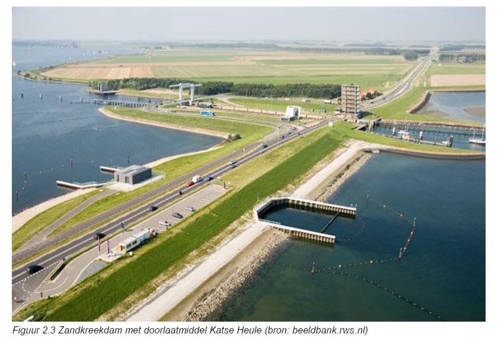
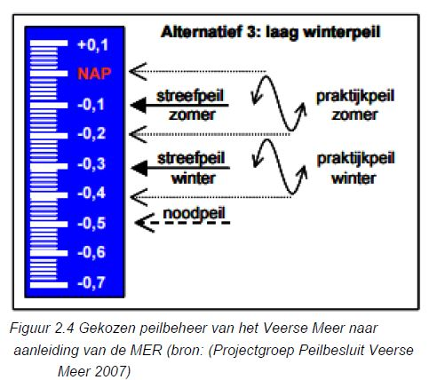
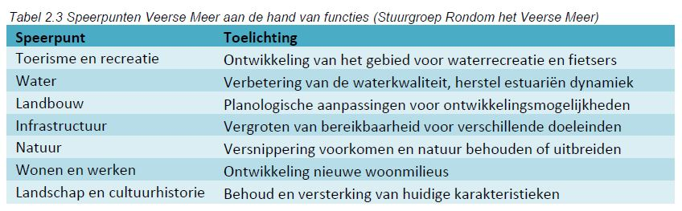
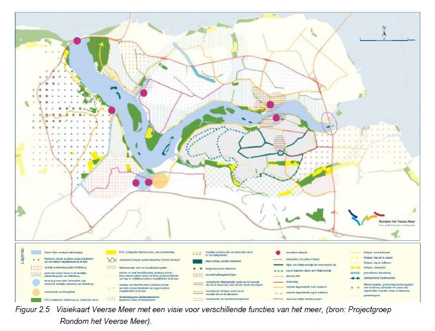

```{r load_packages, include=FALSE}
library(readr)
library(ggplot2)
library(plyr)
library(reshape2)
library(png)
library(pander)
```

#2 Gebiedsbeschrijving

##2.1. Estuarium voor de Deltawerken
Van oorsprong was het Veerse Meer een zeearm, het Veerse Gat, dat tussen Zuid-Beveland, Noord-Beveland en Walcheren een open verbinding had met het Oosterschelde estuarium aan de oostzijde en de Noordzee in het westen (Figuur 2.1). 




De kust van het Veerse Gat had te lijden onder het geweld van de zee. Delen van de kustlijn en waterkeringen langs het Veerse Gat werden in de periode van 1856 tot 1959 geregeld weggeslagen en weer gerepareerd. De watersnoodramp in 1953 heeft rondom het Veerse Gat op negen plaatsen dijken doorbroken en polders doen volstromen. Als gevolg van deze doorbraken zijn ongeveer 60 mensen verdronken in dorpen aan de Zandkreek. Door de ramp bleek dat het deltagebied niet goed genoeg beschermd was tegen mogelijke overstromingen en werd het Deltaplan opgesteld om de waterveiligheid te vergroten (Figuur 2.2).



##2.2. Van estuarium naar kunstmatig meer
Als onderdeel van het Deltaplan is het voormalige Veerse Gat afgesloten van de Oosterschelde in 1960 met een dam (de Zandkreekdam) met daarin een sluis met beperkte wateruitwisseling. Het jaar erop werd het meer afgesloten van de Noordzee met een 3 km lange dichte dam, de Veersegatdam (Figuur 2.1). Deze dammen waren onderdeel van de Deltawerken en zorgden voor het ontstaan van het Veerse Meer. Door de scheiding van de zoute getijdenwateren zou het Veerse Meer oorspronkelijk een zoetwatermeer worden, aangesloten op de Oosterschelde waarvan de afsluiting was gepland. Door de aangelegde Oosterscheldekering die voldoende veiligheid kon garanderen, bleek in 1976 dat de Oosterschelde toch een zout getijdensysteem kon blijven. Als gevolg hiervan gaf de sluis in de Zandkreekdam beperkt uitwisseling met de zoute Oosterschelde en werd het Veerse meer een brak meer met zoutgehaltes tussen 6 en 12 g Cl/l. Een overzicht van de fysieke eigenschappen van het Veerse Meer wordt gegeven in Tabel 2.2 (Wattel 1994).




##2.3. Brak meer na de Deltawerken
Doordat het meer brakker werd dan voor de afsluiting, zijn veel zoutminnende flora en fauna verdwenen na aanleg van de dammen. Er ontstond een nieuw evenwicht dat armer was aan soorten door slechte waterkwaliteit of door het verlies aan landschappelijke gradiënten. Het Veerse Meer kende na de afsluiting van beide dammen geen getij meer maar kreeg in plaats daarvan een tegennatuurlijk peilbeheer, met een winterpeil van NAP-0,70 m, en een zomerpeil van NAP-0,10 m. Het lage winterpeil zorgde er voor dat het meer als een ontvangend oppervlaktewater kan functioneren in de winter, om overtollig regenwater en water van de omliggende landbouwgebieden te ontvangen. Het hoge zomerpeil werd op peil gebracht door zout water binnen te laten stromen en voorkwam de uitdroging van omliggende landbouwgebieden. Het toelaten van zout water in het voorjaar zorgde voor grote fluctuaties in zoutgehalte en gelaagdheid van het water, doordat het zwaardere zoute water onder het zoete water zonk (Craeymeersch & De Vries 2007). De locatie van verschillende poldergemalen die (zoet/brak) water uit de omringende polders lozen op het Veerse Meer is weergegeven in Figuur 2.1.

Als gevolg van het onnatuurlijke peilverloop, de afvoer van voedingsrijk landbouwwater en de zoutfluctuaties, was de waterkwaliteit in het Veerse Meer niet optimaal. Dit heeft gezorgd voor een verminderde ecologische toestand resulterend in grote algenbloei, zuurstofloosheid, slecht doorzicht en grote aanwezigheid van zeesla (Projectgroep Peilbesluit Veerse Meer 2007). Deze ontwikkelingen hadden een negatieve uitwerking op de verschillende functies van het Veerse Meer zoals landbouw, recreatie, visserij en natuur. In 2004 is besloten om deze negatieve processen voor de waterkwaliteit en ecologie tegen te gaan door een doorlaatmiddel aan te leggen in de Zandkreekdam, waarmee de uitwisseling van water met de Oosterschelde vergroot zou worden.

##2.4. Zout meer na het doorlaatmiddel
Het doorlaatmiddel heet de “Katse Heule” vernoemd naar het dorpje Kats dat nabij ligt en het woord “Heule” dat Zeeuws is voor doorlaatmiddel (Figuur 2.3). Het doorlaatmiddel zorgt ervoor dat er ongeveer tienmaal zoveel water kan worden uitgewisseld tussen het Veerse Meer en de Oosterschelde als voor de implementatie van de Katse Heule (Craeymeersch & De Vries 2007). De inbreng van Oosterschelde water zou het zoutgehalte laten stijgen en het zuurstofgehalte in diepere delen van het meer verhogen (Holland et al. 2004). Het doorlaatmiddel in de Zandkreekdam is de waterkwaliteit van het Veerse Meer ten goede gekomen (Stuurgroep Rondom het Veerse Meer 2008) en mariene soorten zullen langzaam toenemen door het verhoogde en meer stabiele zoutgehalte. Hoewel de waterkwaliteit is verbeterd en de biodiversiteit toeneemt, blijft het de vraag of dit herstel volledig zal doorzetten. Zeegras komt niet meer voor en het is onzeker welke vestigingscondities ontbreken. De oevers zijn weinig gevarieerd en missen een natuurhistorische verbinding met het vaste land. Een complicerende factor is daarnaast de massale invasie van Japanse oesters die andere filtrerende bodemdieren verdringt, een laag van schelpenmateriaal achter laat, en overlast veroorzaakt voor (water)recreanten.



##2.5. Aanpassing peilbeheer
De wateruitwisseling tussen het Veerse Meer en de Oosterschelde heeft een positief effect gehad op de waterkwaliteit en het ecologisch functioneren, maar heeft niet het probleem van het onnatuurlijke peilbeheer opgelost (VenW 2007). Er was vooral de wens om de ecologische en recreatieve functies van het meer te verbeteren en er is daarom besloten het peilbeheer aan te passen per 2008 (Figuur 2.4). 



Het peilbeheer is per oktober 2008 aangepast naar een zomerpeil tussen 0.0m en NAP-0,10m en een winterpeil tussen NAP-0.20m en NAP-0.40m (VenW 2007). Deze variant wordt gekenmerkt door het verbeteren van het ecologisch functioneren, het verbeteren van natuur- en recreatiewaarden, het optimaliseren van waterbeheersing bij extreme situaties en het tegemoetkomen aan landbouwbelangen (Projectgroep Peilbesluit Veerse Meer 2007). Het gekozen peilbeheer adresseert daardoor de verschillende functies van het meer. De verhoging van het winterpeil heeft stapsgewijs plaatsgevonden tussen 2008 en 2011 zodat de vegetatie tijd heeft om zich aan te passen.

##2.6. Visie voor het Veerse Meer en de huidige situatie
De afgelopen jaren hebben er veel veranderingen plaatsgevonden in het Veerse Meer om de kwaliteit voor verschillende functies van het meer te verbeteren. De projectgroep “Rondom het Veerse Meer” heeft een gebiedsvisie gemaakt waar tussen 2010 en 2015 gewerkt werd naar specifieke doelen voor het gebied op basis van de functies die voor het meer van belang zijn (Stuurgroep Rondom het Veerse Meer) (Figuur 2.5, Tabel 2.3). Het Veerse Meer kent de volgende gebruiksfuncties: waterkeren, waterafvoer, beroepsscheepvaart, recreatievaart, zwemwater, oeverrecreatie, sportvisserij, beroepsvisserij en ecologie.

 


Vooral recreatie en natuur zijn als belangrijke functies aangewezen in de visie voor het Veerse Meer (Stuurgroep Rondom het Veerse Meer). Het meer heeft een natuurfunctie voor overwinterende watervogels en is onder de Vogelrichtlijn aangewezen als Natura 2000 gebied. In het Veerse Meer bevinden zich broedkolonies van kleine mantelmeeuwen, aalscholvers en van lepelaars. Daarnaast is het gebied een hoogwatervluchtplaats voor vogels van de Oosterschelde en Westerschelde. Het Veerse Meer is als overwinteringsgebied van belang voor viseters, steltlopers, eenden, ganzen en zwanen. Verder kent het gebied een grote populatie van de Noordse Woelmuis en zijn er een aantal natuur- en recreatiegebieden zoals de Goudplaat. Het combineren van de natuurfunctie met andere functies zoals waterveiligheid door middel van bijvoorbeeld natuurvriendelijke oevers, kan een meer integrale benadering van het gebied bevorderen (Rondom Het Veerse Meer 2005). De verbetering van de waterkwaliteit biedt ontwikkelingsruimte voor ecologie en recreatie wat het behalen van het streefbeeld ten goede zal komen.

Van de ingrepen in het Veerse Meer in de afgelopen jaren wordt een positief effect verwacht op de verschillende functies van het meer door een verbetering in de waterkwaliteit. Het doorlaatmiddel heeft ervoor gezorgd dat de waterkwaliteit boven verwachting is verbeterd (Stuurgroep Rondom het Veerse Meer 2008). Door het aangepast peilbeheer en het doorlaatmiddel is de afwatering van omliggende polders gehandhaafd, terwijl het doorzicht en waterkwaliteit is verbeterd en er langzaam meer mariene soorten terugkeren naar het meer.

Bij de aanpassing van het peilbeheer is afgesproken om in 2015 het besluit te evalueren. De huidige situatie en de veranderingen die hebben plaatsgevonden over de afgelopen periode 2000 – 2015 zullen in deze bekkenrapportage beschreven worden.
