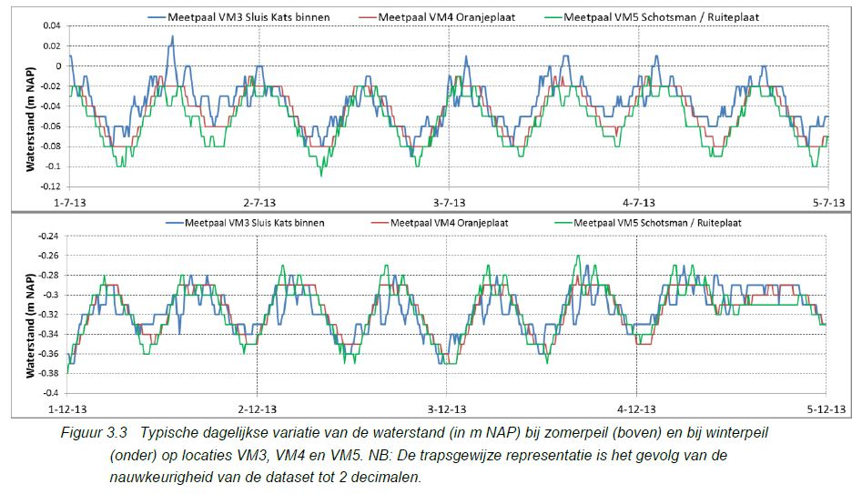
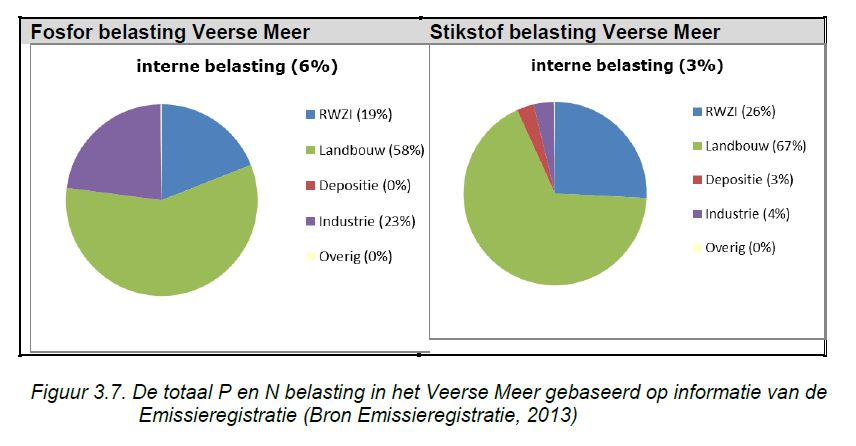

```{r load_packages, include=FALSE}
library(readr)
library(ggplot2)
library(plyr)
library(reshape2)
library(png)
library(pander)
```
#3. Waterhuishouding
##3.1. Peilbeheer en peilverloop
###3.1.1. Monitoring
De waterstand is gemeten op twee vaste meetpalen over de hele periode 2000-2015 en op een derde meetpaal vanaf 2005 (Tabel 3.1). De meetfrequentie is 10 minuten.


###3.1.2. Peilverloop
Figuur 3.1 toont de daggemiddelde waterstand waarin het winterpeil en het zomerpeil duidelijk te onderscheiden zijn. Met uitzondering van 2005 en 2008 was de opzet van winter- naar zomerpeil afgerond rond 1 april. In 2005 en 2008 was de peilopzet halverwege maart afgerond. De verlaging van zomer- naar winterpeil was meestal afgerond rond 1 november met uitzondering van 2004 en 2010 toen peilverlaging rond 10 november werd afgerond.
In Figuur 3.2 wordt de variatie van de waterstand getoond in een boxplot, waarbij onderscheid gemaakt wordt tussen het winterpeil en het zomerpeil. Hiervoor is respectievelijk de periode 15 november tot 1 maart en de periode 1 april tot 1 oktober aangenomen. In de boxplot is de mediaan aangegeven met een horizontale lijn, het 25- en 75-percentiel als de boven- en onderkant van de ‘box’ en het 5- en 95-percentiel als de boven- en onderkant van de verticale lijn.


Van 2000 tot 2014 is het zomerpeil gelijk gebleven met een mediaan van circa NAP-0,05 m. Na 2009 is het winterpeil in drie stappen verhoogd (najaar 2008, 2010, 2011) tot het huidige peil van NAP-0,3 m in het oosten. In het midden en westen is de huidige middenstand met NAP-0,27 m enkele centimeters hoger. De ingebruikname van de Katse Heule in 2004 heeft ervoor gezorgd dat de variatie in het winterpeil afgenomen is van maximaal 0,35 m tot circa 0,2 m. De grotere afvoercapaciteit van de Katse Heule maakt het mogelijk om de waterstand rondom het streefpeil te handhaven ook bij grote aanvoer vanuit de omliggende polders.

Tenslotte laat Figuur 3.3 de dagelijkse variatie van de waterstand als gevolg van in- en uitstroming door de Katse Heule zien. Hiervoor is een willekeurige periode in 2013 gekozen. Het getoonde winterpeil betreft dus de situatie na uitvoering van het peilbesluit. De typische dagelijkse variatie is circa 8 cm bij zomerpeil en 6 cm bij winterpeil.



##3.2. Waterbalans (Polderlozingen, uitwisseling)
###3.2.1 Monitoring
Het waterschap Scheldestromen meet bij een aantal gemalen de waterafvoer en de waterkwaliteit. Dit gebeurt bij een aantal gemalen die direct op het Veerse Meer lozen of loosden (Willem, Adriaan, Wilhelmina, De Piet, Oostwatering). Ook zijn metingen verricht aan de gemalen die op het Kanaal door Walcheren lozen (Poppekinderen, Boreel). De gemalen zijn weergegeven in Figuur 2.1.


###3.2.2 Waterafvoer
Rondom het Veerse Meer liggen een aantal gemalen en uitwateringssluizen die water uit de omliggende polders lozen op het Veerse Meer. De totale waterafvoer vanuit de polders bedraagt 25-85 miljoen m3/jaar (Holland et al. 2004, Craeymeersch & De Vries 2007). Sinds 2009 is het gemaal Oostwatering, dat bij Veere direct op het Veerse Meer loosde, alleen nog bij extreme regenval actief. Het polderwater van het noordelijk deel van Walcheren dat afgevoerd werd via gemaal Oostwatering, wordt sinds 2009 via gemaal Poppekinderen afgevoerd naar het Kanaal door Walcheren.
Naast het gemaal Poppekinderen loost ook gemaal Boreel op het Kanaal door Walcheren. Door schutverliezen in de sluizen bij Veere wordt jaarlijks ongeveer 25 miljoen m3 water vanuit het Kanaal door Walcheren afgevoerd naar het Veerse Meer, dit is ongeveer 40% van het water dat wordt afgevoerd uit het kanaal. Ongeveer 60% wordt afgevoerd naar de Westerschelde via de sluizen bij Vlissingen (Schmidt et al. 2003). Het neerslagoverschot (neerslag – verdamping) is ongeveer 3,5 miljoen m3.
Uit de metingen van het waterschap blijkt dat de belasting met zoetwater via de afvoer van gemalen over de periode 2005-2013 niet significant veranderd is (Fig. 3.4).

##3.3. Vrachten van stoffen
###3.3.1. Monitoring
Gegevens over de vrachten van stoffen zijn gebaseerd op maandelijkse metingen door het Waterschap Scheldestromen bij een aantal gemalen die op het Veerse Meer lozen of loosden (Willem, Adriaan, De Piet, Oostwatering), en gemalen die op het Kanaal door Walcheren lozen (Poppekinderen, Boreel).
###3.3.2. Vrachten van nutriënten (fosfaat, stikstof).
De vracht van totaal-P via de gemalen die direct op het Veerse Meer lozen, is licht gedaald (ongeveer 16% over 8 jaar) maar deze trend is niet statistisch significant (Fig. 3.5).

De vracht van totaal-N via die gemalen vertoont een statistisch significante dalende trend (Mann-Kendal test, p<0.05) en is in 8 jaar bijna 40% afgenomen (Fig. 3.6). Dit is niet het geval voor de polderlozingen op het Kanaal door Walcheren, door de bouw van het gemaal Poppekinderen. De daling in de stikstofvrachten naar het Veerse Meer wordt niet veroorzaakt door een daling in de hoeveelheid water die de gemalen lozen, maar door daling in de concentraties in het water dat de gemalen uitstoten. Voor alle gemalen waar gegevens voor beschikbaar zijn, met uitzondering van Gemaal Boreel dat bij Middelburg in het Kanaal door Walcheren loost, geldt dat de (debiet-)gewogen concentraties van totaal-stikstof over de periode 2005-2013 significant gedaald zijn (Mann-Kendal test, p<0.05).


Indicatieve vrachtgegevens zijn gebaseerd op de Emissie registratie.
Voor N en P zijn de diffuse en puntbronnen van het Veerse Meer berekend met gegevens uit de landelijke Emissieregistratie (RWS, 2012). Het blijkt echter dat de vrachtberekeningen voor het Veerse Meer onjuistheden bevatten (pers.med. N.van Duijnhoven).
Uit Figuur 3.7 blijkt dat de totale P- en N-belasting van het Veerse Meer vooral wordt bepaald door voorbelasting, d.w.z. door bronnen in gebieden die afwateren op het Veerse Meer. De fosfor- en stikstofbelasting van het Veerse Meer in 2013 werd gedomineerd door landbouwemissies, met lozingen vanuit RWZI’s en industrie als belangrijkste andere bronnen.


###3.3.3. Vrachten van vervuilende stoffen
Koper is een probleemstof in het Veerse Meer (Bellert et al. 2014). Vrachten van koper via de lozingen van poldergemalen naar het Veerse Meer blijken in de periode 2005-2013 variabel met aanzienlijk lagere vrachten vanuit de gemalen die direct op het Veerse Meer lozen in de laatste jaren (2010-2013). De reeks is te kort om te kunnen bepalen of hier sprake is van een statistisch significante trend (Figuur 3.8).
