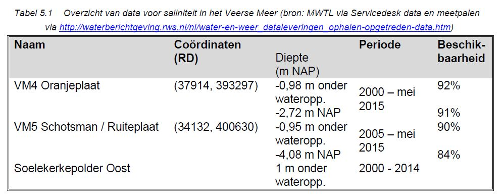

```{r load_packages, include=FALSE}
library(readr)
library(ggplot2)
library(plyr)
library(reshape2)
library(png)
library(pander)
```


```{r, echo = FALSE}
wdir <- ("n:/Projects/1220000/1220248/B. Measurements and calculations/Meetpalen VM3 VM4 VM5")
```

```{r, echo = FALSE, cache=T}
VM5<-read.csv2(file.path(wdir,"Meetpaal_VM5_2000-2015.csv"), na = 999.999, dec = ".")
VM5 <- VM5[c("Datum", "Peil", "Waterstand", "Temperatuur_boven", "Temperatuur_beneden", "Saliniteit_boven", "Saliniteit_beneden")]
VM5$Datumtijd <- as.POSIXlt(VM5$Datum, format = "%d-%m-%Y %H:%M", tz = "UTC")
VM5$Datumtijd <- as.POSIXct(VM5$Datumtijd)
VM5$Meetpaal <- "VM5"

VM4 <- read.csv2(file.path(wdir,"Meetpaal_VM4_2000-2015.csv"), na = 999.999, dec = ".")
VM4 <- VM4[c("Datum", "Peil", "Waterstand..m.NAP.", "Temperatuur_boven", "Temperatuur_beneden", "Saliniteit_boven", "Saliniteit_beneden")]
colnames(VM4) <- c("Datum", "Peil", "Waterstand", "Temperatuur_boven", "Temperatuur_beneden", "Saliniteit_boven", "Saliniteit_beneden")
VM4$Datumtijd <- as.POSIXlt(VM4$Datum, format = "%d-%m-%Y %H:%M", tz = "UTC")
VM4$Datumtijd <- as.POSIXct(VM4$Datumtijd)
VM4$Meetpaal <- "VM4"

VM <- rbind(VM4, VM5)
```


```{r, echo=FALSE}
VM$Datum <- as.Date(VM$Datumtijd)
VMdag <- ddply(VM, .(Datum, Meetpaal), summarize,
           GemWaterstand = mean(Waterstand),
           GemTemperatuur_boven = mean(Temperatuur_boven),
           GemTemperatuur_beneden = mean(Temperatuur_beneden), 
           GemSaliniteit_boven = mean(Saliniteit_boven),
           GemSaliniteit_beneden = mean(Saliniteit_beneden))
VMdag_tidy<-melt(VMdag, id.vars = c("Datum", "Meetpaal"))
VMdag_tidy$Meting<-paste(VMdag_tidy$Meetpaal, VMdag_tidy$variable)
```

#5. Waterkwaliteit
##5.1. Monitoring
Waterkwaliteitsgegevens worden gemeten in het MWTL monitoringsprogramma van Rijkswaterstaat. De gegevens die hier gepresenteerd worden zijn afkomstig van metingen van het monsterpunt Soelekerkerpolder Oost, tenzij anders vermeld. Hier wordt 1-2 maal per maand gemeten. Omdat dit meetpunt het enige doorlopende meetpunt voor waterkwaliteit in het Veerse Meer is, worden deze data hier gepresenteerd. In het verleden werd ook op andere punten waterkwaliteit gemeten, maar die metingen zijn niet voortgezet na 2007.
##5.2. Saliniteit (chloride)
Het Veerse Meer is door de opening van de Katse Heule aanzienlijk zouter geworden. De huidige saliniteit (28-30 ppt1) is maar weinig lager dan die in de Oosterschelde (Wissenkerke 32 ppt). De seizoensvariatie is hetzelfde gebleven. Het Veerse Meer is in de (na)zomer zouter dan in de winter. Het verschil is ongeveer 5 ppt. De verticale verschillen zijn door de Katse Heule sterk verminderd. De verticale gradiënt bedroeg vóór de opening van de Katse Heule meer dan 5 ppt, na de opening 2 ppt.
Door de Katse Heule is, evenredig met het toegenomen zoutgehalte, het percentage zoet water sterk verminderd, van ongeveer 45% naar ongeveer 15%. De oorzaak is niet een verminderde polderbelasting, maar een grotere uitwisseling met de Oosterschelde waardoor het zoete water wordt verdund en afgevoerd.
Figuur 5.1 toont de daggemiddelde saliniteit gemeten op locaties VM4 en VM5. De seizoensvariatie met hogere saliniteit in de zomer en lager saliniteit in de winter en de sprong in saliniteit na de ingebruikname van de Katse Heule in 2004 springen het meest in het oog.



```{r, echo=FALSE}
plot <- ggplot(subset(VMdag_tidy, VMdag_tidy$variable %in% c("GemSaliniteit_boven", "GemSaliniteit_beneden")), aes(Datum, value))
plot + geom_line(aes(color = Meting))
```

##5.3. Temperatuur
De watertemperatuur in het Veerse Meer varieerde in de periode 2000-2014 tussen 0,5 en 24,0 graden Celsius (Figuur 5.2). De gemiddelde jaartemperatuur ligt tussen 10,9 en 13,0 graden Celsius en vertoont geen trendmatige verandering (Figuur 5.3).

```{r, echo=FALSE}
plot <- ggplot(subset(VMdag_tidy, VMdag_tidy$variable %in% c("GemTemperatuur_boven", "GemTemperatuur_beneden")), aes(Datum, value))
plot + geom_line(aes(color = Meting))
```

##5.4. Zwevende stof en doorzicht

##5.5. Nutrientenconcentraties

##5.6. Verontreinigende stoffen


